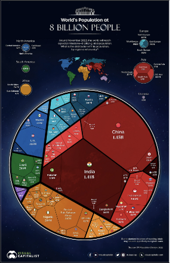
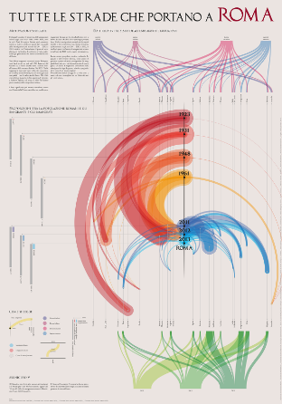
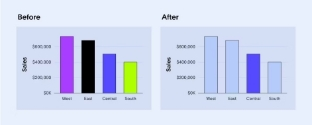
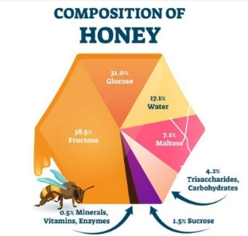

Nama : Gymnastiar Al Khoarizmy

NIM : 122450096
# **Tugas VDI Minggu 2 : Key Principles**
- Good Visualization

  Berdasarkan 4 key principles, pada key forms and functions, selain dari bentuk yang tertata dengan rapih visualisasi ini memiliki fungsi yang berfokus pada memperlihatkan distribusi populasi penduduk di dunia untuk setiap negaranya. Selanjutnya pada key justifying the selection of everything we do, pada setiap properti visualisasi yang disajikan baik itu penggunaan warna, luas daerah lingkaran, hingga posisi negaranya, tidak ada yang berlebihan dan semuanya terstruktur. Lalu key Creating accessibility through intuitive design, pembaca dapat menginterpretasikan setiap atribut visual dengan mudah, legenda yang menjelaskan benua disesuaikan dengan warna yang mudah sehingga pembaca dapat cepat menafsirkan visualisasinya. Selanjutnya key yang terakhir, never deceive the reader, ukuran dari setiap besar populasi sesuai dengan besarnya luas lingkaran sehingga pembaca tidak terkecoh dalam membaca visualisasinya.Gambar visualisasi kedua ini menerapkan prinsip form and function dengan menyajikan aliran data yang kompleks secara visual melalui bentuk lengkungan berwarna, yang mempermudah pembaca memahami arus migrasi dan data populasi terkait Roma. Setiap unsur seperti warna dan ketebalan garis dipilih dengan hati-hati (justifying the selection of everything we do), misalnya warna merah mewakili aliran historis, sedangkan biru dan hijau menunjukkan imigrasi modern. Creating accessibility through intuitive design terlihat dari penggunaan legenda dan kode warna untuk memisahkan informasi berdasarkan kategori waktu, jenis kelamin, dan status imigrasi, sehingga mudah dipahami oleh audiens. Terakhir, never deceive the reader dijaga dengan memastikan bahwa representasi data akurat, di mana aliran dan ukuran garis benar-benar mencerminkan volume data yang relevan, menjamin transparansi informasi yang disajikan.

- Bad Visualization

  

  Grafik kiri menunjukkan bad visualization karena warna-warna mencolok tidak memenuhi prinsip forms and functions, di mana tampilan seharusnya mendukung tujuan komunikasi. Pilihan warna tidak justifying the selection, mengganggu fokus tanpa alasan yang jelas. Selain itu, grafik tidak creating accessibility karena warna-warna kontras bisa sulit dilihat bagi sebagian orang, terutama mereka yang mengalami buta warna. Terakhir, meskipun tidak secara langsung deceiving, penggunaan warna yang salah memberi kesan bahwa data tertentu lebih penting tanpa dasar yang jelas, sehingga menyimpangkan interpretasi audiens.

  

  Berdasarkan 4 key principles, visualisasi ini memiliki bentuk dan fungsi (forms and functions) yang bertujuan memperlihatkan komposisi madu berdasarkan kandungan nutrisinya. Namun, pada justifying the selection, ukuran segmen pada pie chart ini tidak sepenuhnya mencerminkan proporsi data yang akurat. Misalnya, segmen 38,5% untuk fruktosa tidak jauh lebih besar dari segmen 31% untuk glukosa. Pada key creating accessibility, meskipun warna-warna berbeda membantu identifikasi, ukuran segmen yang tidak proporsional dapat membingungkan pembaca. Terakhir, pada key never deceive, visualisasi ini dapat menyesatkan karena proporsi ukuran segmen tidak sesuai dengan data asli.
